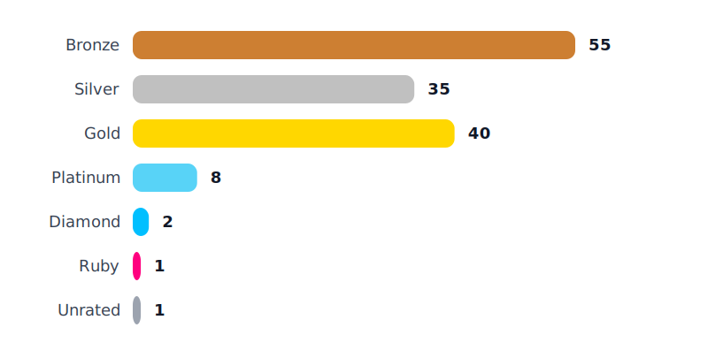
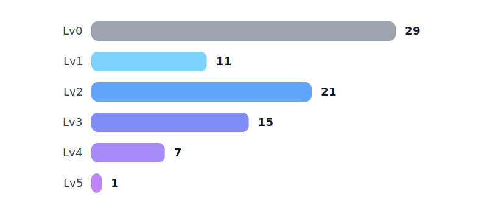

# Baekjoon Problem Solving Log

Welcome to my personal repository for solving problems from [Baekjoon Online Judge](https://www.acmicpc.net/).  
This repo is auto-pushed using [BaekjoonHub](https://github.com/BaekjoonHub/BaekjoonHub) extension.

## 📊 Stats

<!-- STATS_START -->

### 🥇 Baekjoon

  

### 💻 Programmers

  

### 🚀 Solving Progress

| Category | Count |
|---|---:|
| 🥇 Baekjoon | 142 |
| 💻 Programmers | 90 |
| 🏆 Total | 232 |

<!-- STATS_END -->

## ✨ Features

- 언어: C++(백준), Python(프로그래머스)
- 코드 자동 업로드 (via BaekjoonHub)

## 📁 Directory Structure

BaekjoonHub 확장 프로그램을 사용하여 **난이도별**로 폴더가 자동 생성됩니다.  
각 문제는 문제번호 폴더에 `문제이름.확장자` 형식으로 저장됩니다.
